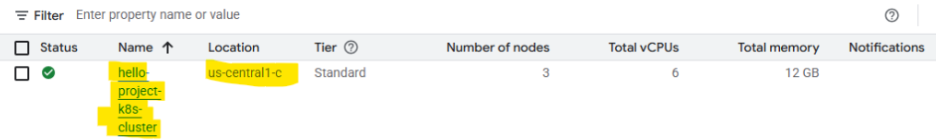
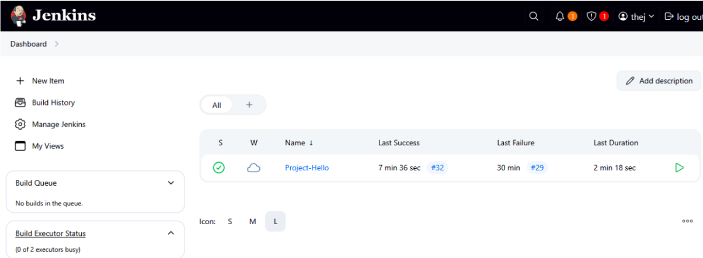
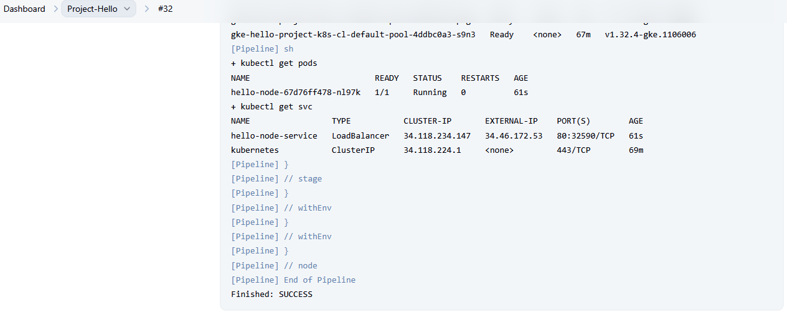
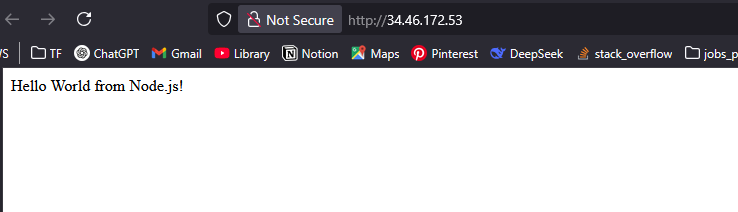

1. Create a VM machine on GCP Install ansible 
2. Created a playbook.yml file to install required softwares For Jenkins Setup and Docker, curl, Kubectl,gloud cli, gcloud plugin setup 
3. Open Firewall Rule 8080 for Jenkins
4. Create ServiceAccount with Admin Artifactory Registry -> Attach to jenkins VM 
6. Setup Jenkins web-UI 
7. Download Plugings From Manage Jenkins Docker Pipeline, Kubernetes CLI Plugin, Google OAuth Credentials plugin, Pipeline plugin 

# Jnkins Login page 

# webhook Job Trigger
 

# Using Webhook Integration 

# Cluster Setup Image 

# Accessing From Browser 
- Enable Firewwall rule

