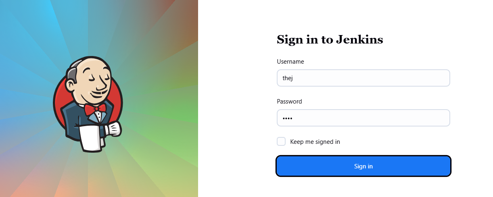
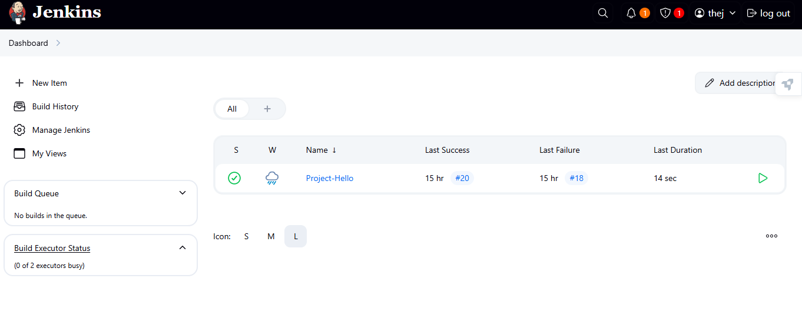
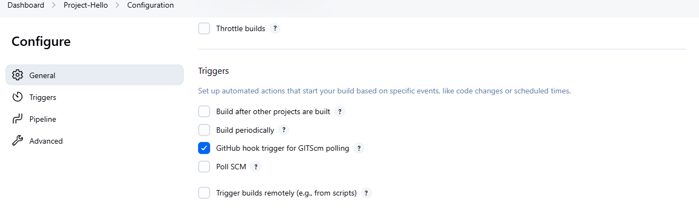
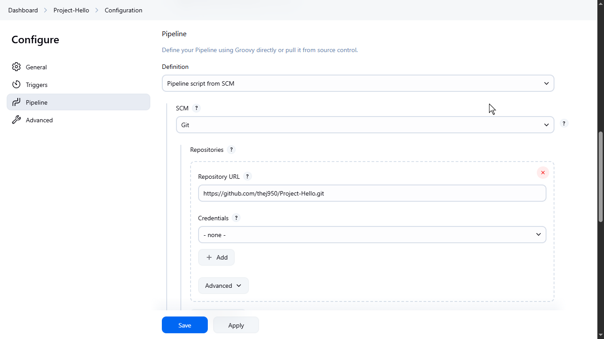
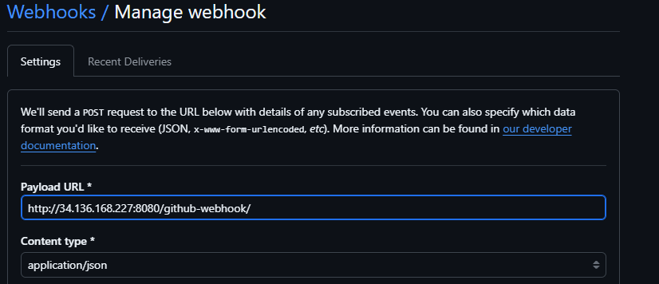
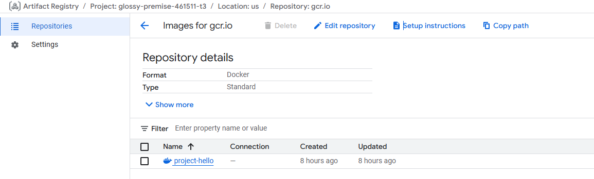
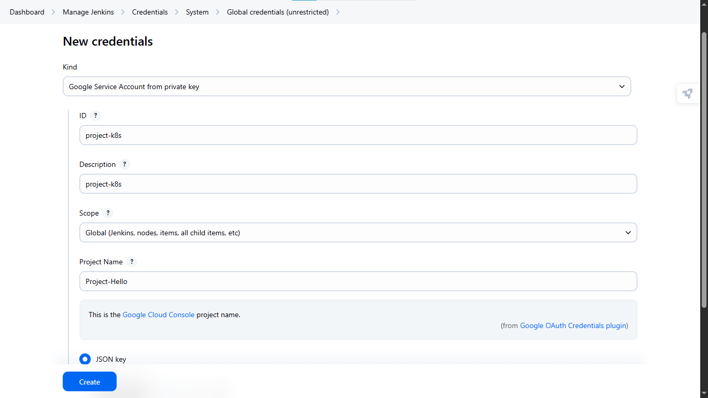
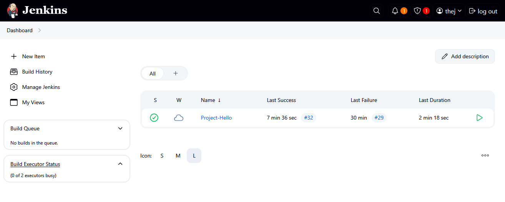
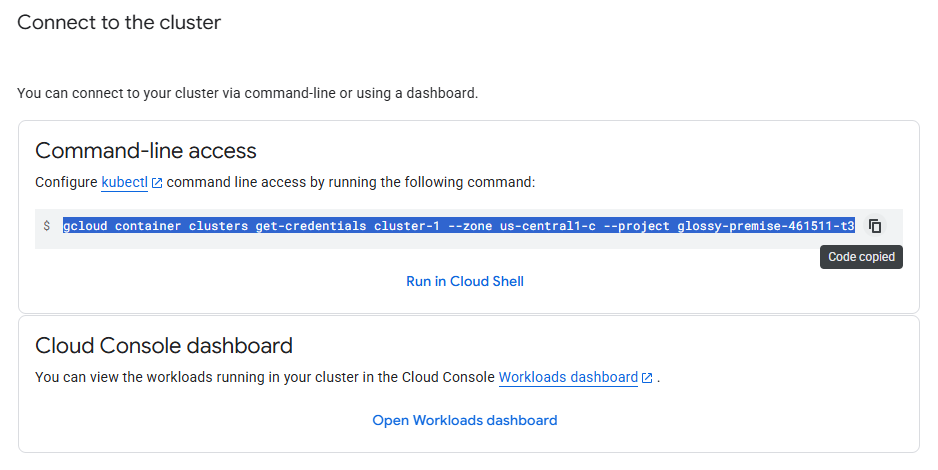
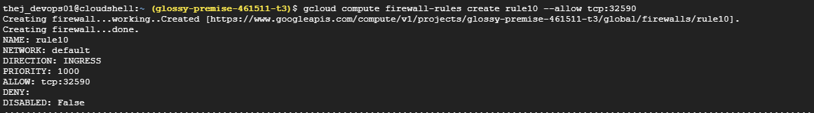

1. Setup Jenkins-Server On GCP 
2. Open Firewall Rule 8080 for Jenkins
3. Install Docker 
4. Add Jenkins user into Docker group 
5. Create ServiceAccount with Admin Artifactory Registry -> Attach to jenkins VM 
6. Setup Jenkins web-UI 
7. Download Plugings From Manage Jenkins Docker Pipeline, Kubernetes CLI Plugin, Google OAuth Credentials plugin, Pipeline plugin 
8. Install tools gcloud and kubectl, Configured access to GCP SDK

# Jnkins Login page 

# webhook Job Trigger
 

# Using Webhook Integration 

# Cluster Setup Image 

# Accessing From Browser 

